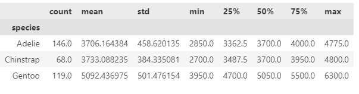
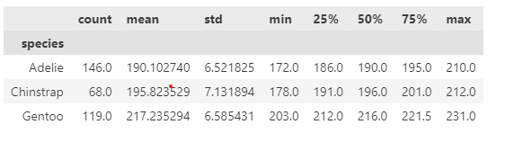
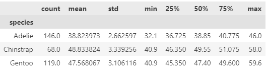
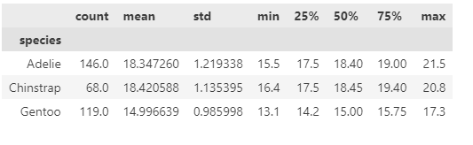

## Higher Diploma in Science: Computing-Data Analytics 2024
### Module: Principles of Data Analytics

# **Analysis of the Palmer Penguins Dataset**

***

### Background:

The Palmer Penguins dataset contains data relating to size measurements for three species of penguins, Adelie, Chinstrap and Gentoo.  The data was collected from three islands in the Palmer Archipelago, Antarctica from 2007-2009, as part of research carried out by Dr. Kristen Gormen  '_[Ecological Sexual Dimorphism and Environmental Variability within a Community of Antarctic Penguins(Genus Pygoscelis)'](https://journals.plos.org/plosone/article?id=10.1371/journal.pone.0090081)_ in association with the Palmer Station Long Term Ecological Research Program. The Palmer Station is located on Anvers Island in the Antarctic Peninsula. 

<!DOCTYPE html>
<html lang="en">
<head>
    <meta charset="UTF-8">
    <meta name="viewport" content="width=device-width, initial-scale=1.0">
  
</head>
<body>

<table>
    <thead>
        <tr>
            <th>Adelie</th>
            <th>Chinstrap</th>
            <th>Gentoo</th>
        </tr>
    </thead>
    <tbody>
        <tr>            
        </tr>
        <!-- Extra row for images -->
        <tr>
            <td></td>
            <td></td>
            <td></td>
        </tr>
    </tbody>
</table>

</body>
</html>

 

 

### About the dataset: 

The [Palmer Penguins dataset](https://raw.githubusercontent.com/mwaskom/seaborn-data/master/penguins.csv) contains the data of 344 penguins from three species: Adelie, Chinstrap and Gentoo collected from three islands: Biscoe, Dream and Torgersen. 
There are 7 variables. 3 of which are catergorical variables. These include species, island and sex. There are four numerical variables that represent the physical characteristics of the penguins. These include body mass(g), flipper length(mm), bill length(mm) and bill depth(mm). Each row represents a penguin, Each column represents a variable. 

Using python, the different variables were analyzed using various data structures and libraries such as pandas. Pandas is a python library built on top of NumPy for data manipulation and analysis. The main data structures in pandas include dataseries and dataFrames. A dataseries is a 1D array capable of holding any data type such as such as integers, floats, strings, objects. This is similar to Numpy arrays but can be used to access specific elements. A dataFrame is a 2D labelled data structure with columns of different data types, similar to a spreadsheet where each column represents a variable and each row represents an observation. In this analysis the dataset was loaded from the .csv file on the seaborn github repository into a dataFrame using pandas

***

## Summary Statistics:

The describe() function in pandas generates descriptive statistics of the dataframe. It gives a summary of the central tendency, disperson and shape of the distribution of the dataset. 

Body Mass(g):

 
The Gentoo penguin has the largest body mass with a mean of 5092g. The Adelie penuin with a mean of 3706g and Chinstrap penguins with a mean of 3733g are smaller than Gentoo and are closer in size.  The median is athe center value of a set of numbers. The mean and the median only differs by a small amount which could be explained by outliers in the data or difference between male and female penguins. Also it is expected that there would be body mass variation between penguins due to diet and environment.     
  
The measure of dispersion from the mean is called standard deviation. when the standard deviation is low, it means that the data 

Flipper Length(mm):

Bill Length(mm):

Bill Depth(mm):

Main Observations:

Gentoo largest in body mass and flipper length. 
 Chinstrap largest bill depth, close to adelie bill length
  Gentoo smallest bill depth 
  Chinstrap longest bill length

## Data Visualisation:

### **Barchart:**

 
 
        

 The barchart shows the variations in body mass per species and islands. Each bar represents the average body mass of each species and sex of the penguins on a particular island. From observation of the barchart male penguins are larger than female penguins. Male and female Gentoo penguins show a notable difference in body mass in comparison to Adelie and Chinstrap penguins. Adelie and Chinstrap penguins are similar in size for both male and female penguins. 

 

## Correlation:

#### Pairplot: 
 
 
A pairplot is used to see if there is any relationships between two variables. 
The plots are in a matrix format where the row name represents the x-axis and column name represents the y-axis. The main diagonal subplots are the histogram distributions for each variable. 

The main observations from the pairplot is that the Gentoo penguins are linearly separated from the Adelie and Chinstrap penguins in body mass vs bill depth and flipper length vs bill depth. The Adelie and Chinstrap appear more clustered together in most plots. The plot which appears to have the least amount of overlap between the three species combined is bill length vs bill depth.  There is a minimal amount of overlap seen for Gentoo penguins in flipper length and body mass with Adelie and Chinstrap but Gentoo can still be seen to form a clear cluster and have a good degree of separation. From the pairplot there seems to be a positive linear relationship between body mass and flipper length as the data points cluster around a straight line that slopes upwards from left to right, showing a consistent relationship between the two variables with all species combined. The correlation coefficient is 0.87 as can be seen on the correlation heatmap below, This result indicates a strong positive linear correlation. 

**Correlation Heatmap:**

 
 
 

**Scatterplot:**
 
 

Scatterplots are used to identify correlations between two variables.
There is a strong positive correlation between body mass and flipper length. The correlation coefficient is 0.87 which is close to 1. The closer a value is to 1 the higher the correlation. The correlation coefficient indicates the strength and the direction of the linear relationship. A positive correlation suggests that as one variable increases the other variable tends to increase also. In this case as the body mass of the penguins increases the flipper length of the penguins also increases. The slope of the line is 50.1533 which means on average for every 1mm increase in flipper length the body mass of the penguins increases approximately 50.1533g. The slope represents the rate of change in the dependent variable (body mass) for a one unit change in the independent variable (flipper length). 

**Correlation Heatmap per Species:**
 

**Scatterplots of flipper length vs body mass per species:**

 

When separated by species, the correlation coefficient values were lower than when all data was combined. The highest correlation coefficient is seen with Gentoo penguins at 0.71, while not as high as when all species are combined it still indicates a relatively strong positive relationship between the variables. The data points are more clustered near the line than can be seen with Adelie. Chinstrap had a correlation coefficient of 0.64 which suggests a moderately strong positive linear relationship. Adelie had the lowest correlation value at 0.46 which shows a weaker relationship between the variables than Gentoo or Chinstrap penguins. However a moderate positive relationship is stil seen. 

### Scatterplots of flipper length vs body mass per species and sex: 

When separated based on species and sex, the correlation coefficient value was lower for penguins except Chinstrap males which gave a slightly higher correlation value of 0.66. Although the relationship is weaker between the variables a linear positive relationship is still seen.

## Discussion:

The result shows that is a strong positive correlation between body mass and flipper length. 
The stronger correlation coefficient observed when not separated based on sex or species could suggest a more consistent or stronger relationship between flipper length and body mass when considering all data points regardless of species or sex. Lower correlation coefficients could be due to outliers, smaller sample sizes or variation within the subsets. Body mass naturally varies among individuals in a population due to genetics, diet, environment etc. From Dr. Gormens research the Adelie penguins foraging niche may have been affected more than Gentoo or Chinstrap penguins in the year with lower sea ice concentrations as they are sea ice obligate.  Analysing all data points together increases the sample size and may give a more accurate estimate of the overall relationship. 

